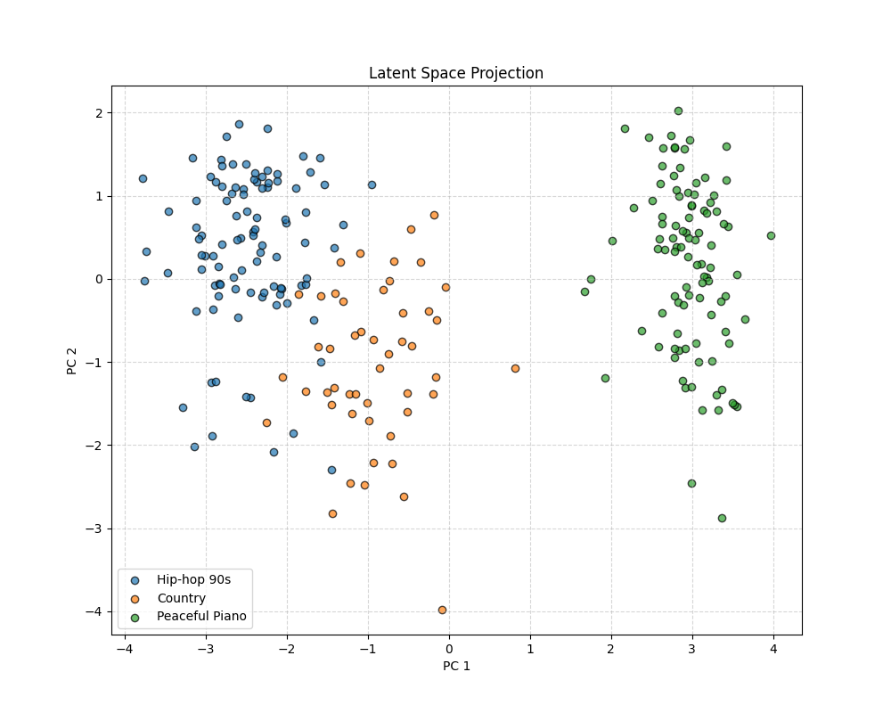
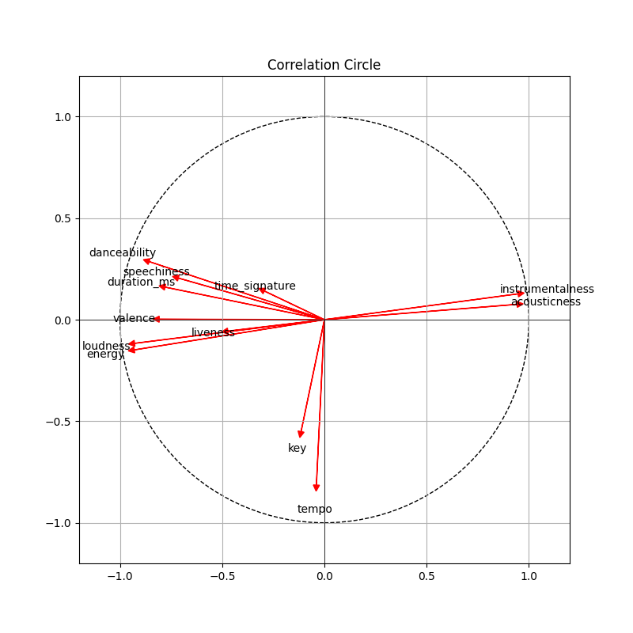

<div align="center">
  <h3 align="center">Spotify PCA Engine</h3>

  <p align="center">
    A from-scratch implementation of <strong>Principal Component Analysis (PCA)</strong> using <strong>NumPy</strong> and Linear Algebra to analyze audio features.
    <br />
    <a href="#-getting-started"><strong>Quick Start »</strong></a>
  </p>
  
  
  
</div>

## 🔍 About The Project
This project is a statistical analysis engine designed to uncover latent structures in high-dimensional audio data. By analyzing the Spotify dataset, it correlates 12 low-level audio features (e.g., tempo, spectral energy, acousticness) with musical genres.

The core engineering goal was to implement **Normalized PCA** entirely from scratch, bypassing high-level abstractions like `scikit-learn`. The engine manually handles the full linear algebra pipeline: data standardization ($Z$-score), covariance matrix computation, and eigendecomposition to project the 12D feature space onto a 2D plane for clustering and visualization.

*Built as a Data Science side project focusing on mathematical implementation.*

### 🛠 Built With
* **Language:** Python 3.10+
* **Core Math:** NumPy (Linear Algebra)
* **Data Processing:** Pandas
* **Visualization:** Matplotlib

## 📐 Architecture

### Technical Highlights
* **Manual Eigendecomposition:** Computes eigenvalues ($\lambda$) and eigenvectors ($v$) directly from the correlation matrix ($C = \frac{1}{n} Z^T Z$) to derive principal components without SVD solvers.
* **Latent Space Projection:** Implements the projection logic $T = Z \cdot W_k$ to map 12-dimensional audio vectors into an interpretable 2D coordinate system. 
* **Supplementary Inference:** Features a generalization pipeline to project new, unseen tracks ("Supplementary Individuals") into the existing PCA space without re-computation, enabling real-time genre prediction.

### File Organization
```text
├── data/
│   └── data_spotify.csv        # Raw dataset (246 tracks, 12 audio features)
├── src/
│   ├── engine.py               # Core CustomPCA class (Covariance & Eigendecomposition)
│   ├── loader.py               # ETL Pipeline (Cleaning & Z-score Prep)
│   └── visualization.py        # Plotting modules (Projection Scatter & Correlation Circle)
├── assets/                     # Generated output plots
├── main.py                     # Entry point & orchestration script
└── requirements.txt            # Python dependencies
```

## 🚀 Getting Started

### Prerequisites
* **Python 3.10+**
* **PIP**

### Installation & Build
1. **Clone and Setup Environment**
   ```bash
   # Clone the repository
   git clone https://github.com/EnzoPicarel/spotify-pca-engine.git
   cd spotify-pca-engine

   # Create and activate virtual environment
   python -m venv venv
   source venv/bin/activate
   ``` 

2. **Install dependencies**
   ```bash
   pip install -r requirements.txt
   ```

## ⚡ Execution
The engine runs as a standalone script. It loads the dataset, trains the PCA model, performs inference on test cases, and generates visualization assets in the `assets/` folder.

```bash
python main.py
```

**Expected Output:**
* **Console:** Variance explained ratios (e.g., `[0.42, 0.28]`) and projected coordinates for test tracks.
* **Files:** 
    * `assets/pca_projection.png`: 2D Scatter plot of genres.
    * `assets/correlation_circle.png`: Feature contribution vectors.

## 📸 Visualizations
| Latent Space Projection | Correlation Circle |
|:---:|:---:|
|  |  |

## 🧪 Tests
To verify mathematical accuracy, the script includes an **Inference Test** on 3 supplementary tracks (Hip-hop, Country, Piano).
* **Success Metric:** The "Piano" track should project into the *Peaceful Piano* cluster (high acousticness), while "Hip-hop" should land in the *Rap* cluster (high energy/speechiness).

```bash
# Verify inference output in terminal
python main.py
```

## 👥 Authors
* **Enzo Picarel**

---
*Original Concept based on ENSEIRB-MATMECA Data Analysis Course.*